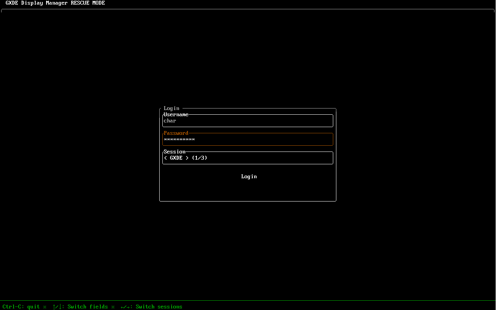

# GXDE Display Manager (救援模式)
## 简介
本程序用于在GXDE Display Manager在各种故障时代替显示管理器，让您登录进系统GUI会话。

本程序不包含任何GUI界面，所有操作均在TTY VT8下执行。



## 编译
### 前提条件
您的系统上需要有`rustc`、`cargo`、`libpam0g-dev`、`libsystemd-dev`和`libclang-dev`。

### 手动编译
```shell
$ cargo build --release
```

### 打包
#### Debian
```shell
$ chmod a+x ./build-deb
$ ./build-deb -d  # 自动安装依赖并编译打包，此后只需要执行./build-deb就好了，因为依赖装过了
$ ./build-deb -c  # 清理仓库用，注意这会清理掉生成的最终产物
```

## 使用
### 使用 `gxdmr` 自动切换
> **注意**: 请在TTY下执行；此脚本仅在Debian包提供，手动安装的用户需要自行拷贝脚本。
> 脚本可以在`./scripts/gxdmr`找到。

#### 启动救援模式
```shell
$ sudo gxdmr <原来显示管理器的服务名>  # 例如: sudo gxdmr gxdm
```

#### 恢复到之前的显示管理器
```shell
$ sudo gxdmr --restore  # 恢复到之前启动前的显示管理器
```

### 手动拉起
> **注意**: 在一些老版本下，您需要手动切换到VT8 (`Ctrl + Alt + F8`). 请在TTY下执行。

```shell
$ sudo systemctl stop <您正在使用的显示管理器>.service     # 例如 sudo systemctl stop gxdm.service
$ sudo systemctl disable <您正在使用的显示管理器>.service  # 例如 sudo systemctl disable gxdm.service
$ sudo systemctl enable gxdm-rescue.service
$ sudo systemctl start gxdm-rescue.service
```

### 恢复到原来使用的显示管理器
> **注意**: 请在登出会话后于TTY下执行。

```shell
$ sudo systemctl stop gxdm-rescue.service
$ sudo systemctl disable gxdm-rescue.service
$ sudo systemctl enable <您正在使用的显示管理器>.service  # 例如 sudo systemctl enable gxdm.service
$ sudo systemctl start <您正在使用的显示管理器>.service   # 例如 sudo systemctl start gxdm.service
```

## 许可证
(C) 2026 CharOfString & GXDE Maintainers.

GXDE Display Manager (救援模式) 以GNU GENERAL PUBLIC LICENSE Version 3协议发行，可以在[这里](./LICENSE)找到一份许可证副本。
